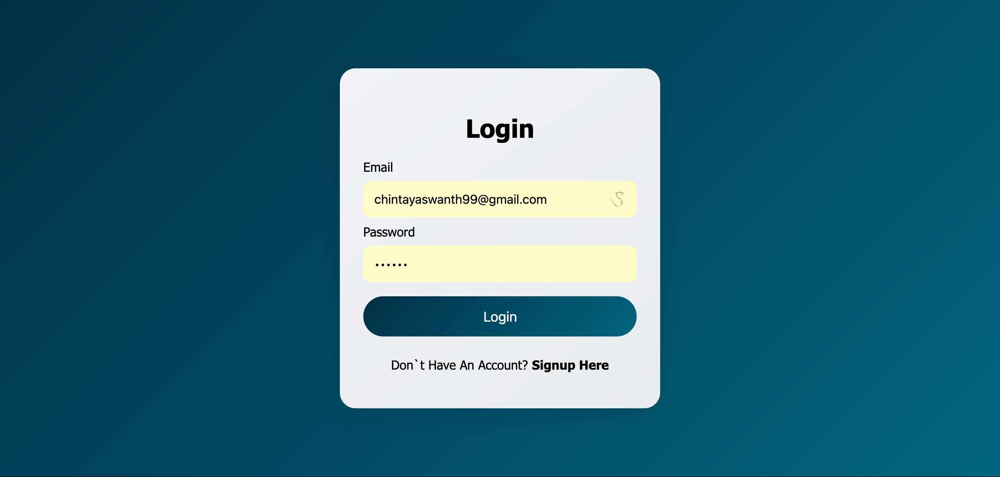
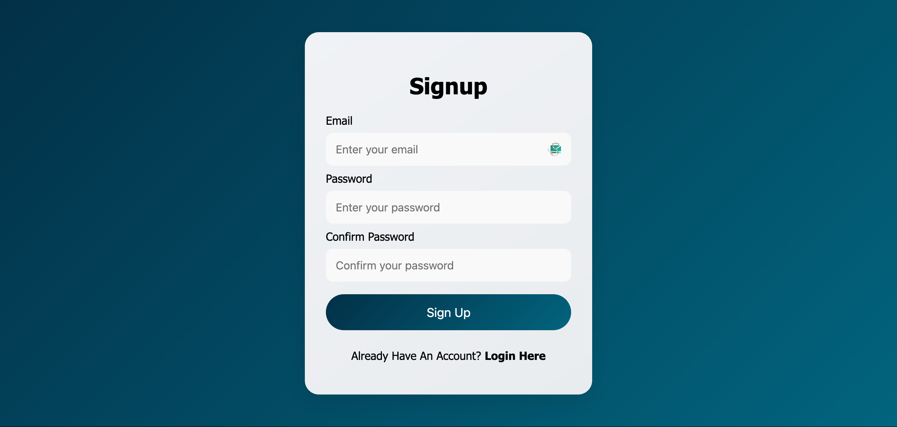
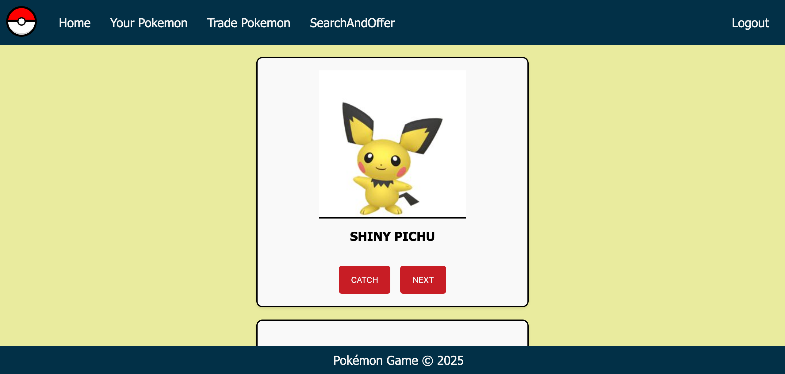
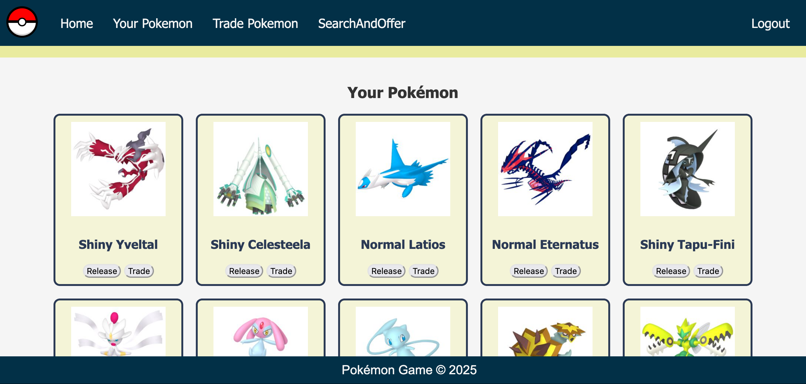
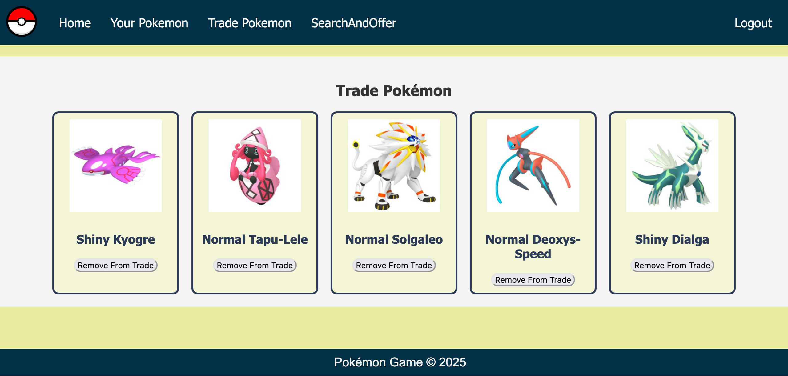
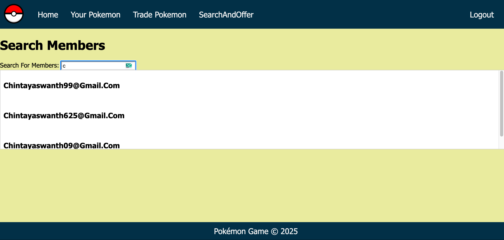
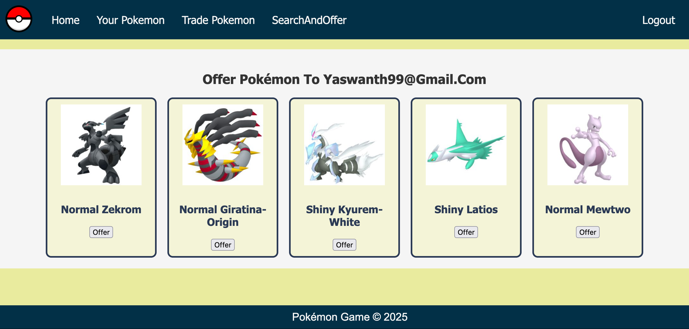

# To Install Dependencies Run
```bash
npm i 
```
# To Run The Project
```bash
nodemon server.js
```

# Some Screenshots Of The Project
* login Page 

* signin Page

* home Page 

* your Pokemon

* your Trade Pokemon

* search Friends For Trading

* trading with Friends



